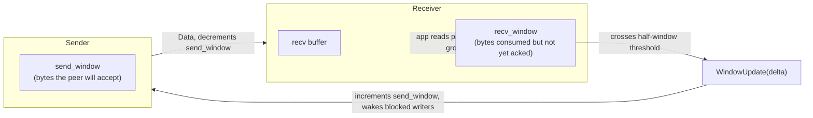
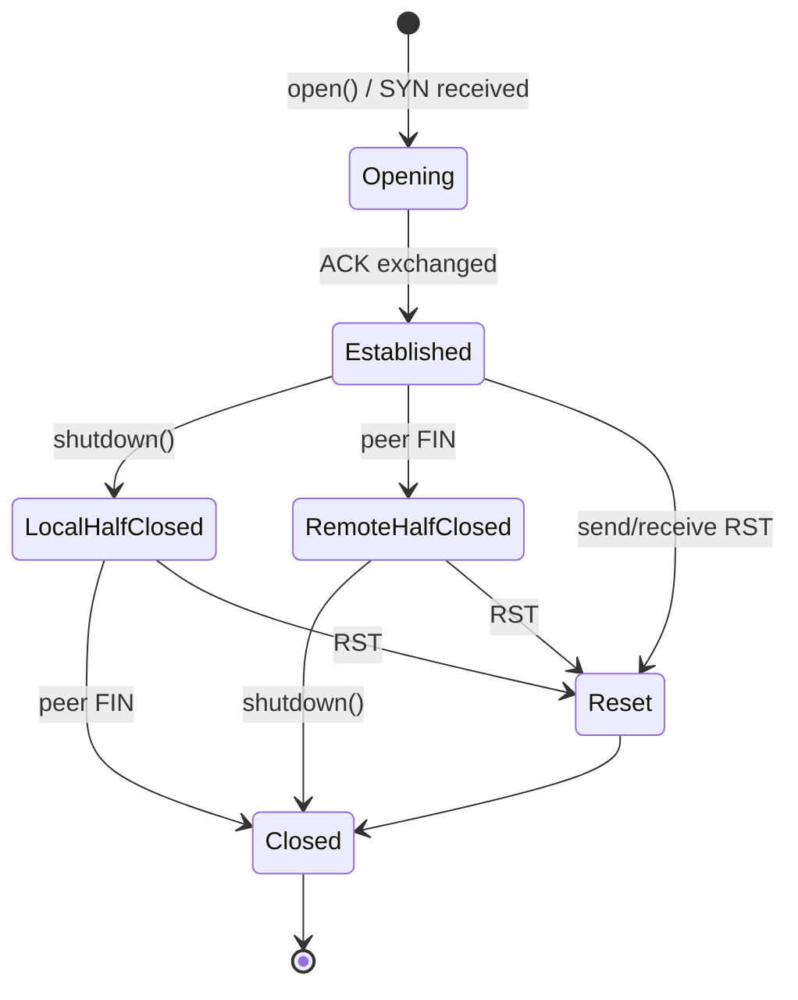
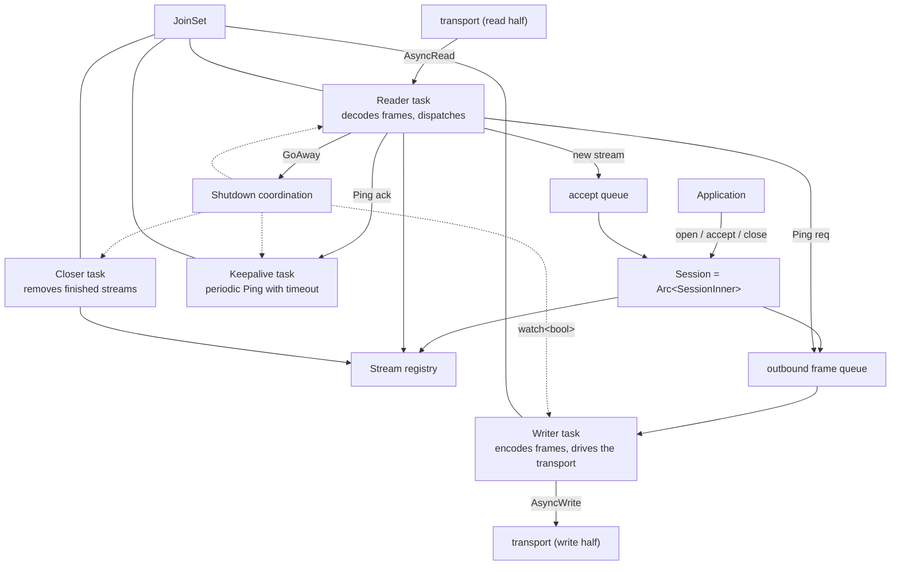

# Architecture

`net-mux` turns a single ordered byte stream — a TCP connection,
TLS-over-TCP, KCP, or anything else that implements `AsyncRead +
AsyncWrite` — into many independent, bidirectional logical streams.

This document is the high-level tour of how the library is structured.
For the bits that go on the wire, see [`protocol.md`](protocol.md). For
implementation details, the source files carry per-module documentation.

## Why a multiplexer?

A single TCP connection imposes ordering and head-of-line blocking on
every byte that travels through it. Real applications often want to run
many independent conversations over the same connection — request /
response, push notifications, file transfers, control channels — without
each one stalling the others.

`net-mux` provides:

- **Multiple logical streams** over one physical connection. Each stream
  has independent ordering, independent back-pressure, and an independent
  lifecycle.
- **Drop-in IO.** Streams implement `AsyncRead` and `AsyncWrite`, so any
  Tokio code that already speaks "byte streams" works unchanged.
- **Credit-based flow control.** A slow consumer on one stream cannot
  stall the others, and total in-flight memory is bounded.
- **Graceful shutdown** with a session-level `GoAway`, half-close on
  individual streams, and timeout-driven keepalive.

## Layered design

```
+-----------------------------------------------------------+
|                       Application                         |
|       Session::{open, accept, close}  ·  Stream IO        |
+-----------------------------------------------------------+
|                          Session                          |
|     reader · writer · keepalive · closer · registry       |
+-----------------------------------------------------------+
|                     Stream + Flow                         |
|    AsyncRead/AsyncWrite · credit windows · stream state   |
+-----------------------------------------------------------+
|                        Protocol                           |
|         Frame model · 12-byte header · FrameCodec         |
+-----------------------------------------------------------+
|         Transport (any AsyncRead + AsyncWrite)            |
+-----------------------------------------------------------+
```

Each layer only depends on the layer immediately below it:

- **Protocol** is pure framing. It does not know what a `Session` or
  `Stream` is; it only converts bytes to and from typed `Frame` values.
- **Stream + Flow** owns one logical stream's state — receive buffer,
  send window, receive window, read/write/reset bits — and exposes a
  standard `AsyncRead` / `AsyncWrite` surface.
- **Session** binds one transport to a registry of streams, runs the
  background tasks that move frames between them, and exposes the public
  `open` / `accept` / `close` API.
- **Transport** is anything you can hand to Tokio's `io::split`.

## Core concepts

### Session

A `Session` wraps one transport and exposes:

- `open()` — initiate a new logical stream. Resolves once the peer has
  confirmed it.
- `accept()` — wait for a stream initiated by the peer.
- `close()` — initiate a graceful shutdown and wait for it to finish.

`Session` is `Clone` (internally an `Arc`), so it can be shared across
tasks freely. All its methods take `&self`.

### Stream

A `Stream` is the logical "connection" you actually do IO on. It
implements `AsyncRead + AsyncWrite + Send + Sync` and behaves like a
TCP socket:

- `read` / `write` are independent — half-close is supported.
- `shutdown` closes the write half but leaves the read half open until
  the peer closes its end.
- Dropping the `Stream` always sends a graceful `FIN` and removes the
  stream from its session's registry.
- `Stream::reset` performs an abrupt `RST` for error paths.

Large user writes are transparently fragmented across multiple frames
respecting `Config::max_frame_size`.

### Frame

The single piece of data that crosses the wire. Frames come in four
shapes:

| Frame | Purpose |
| --- | --- |
| `Data` | Carries user payload. Lifecycle bits (`SYN` / `ACK` / `FIN` / `RST`) ride along as flags, so opening a stream and sending its first byte can be a single frame. |
| `WindowUpdate` | Grants the peer additional credit for a stream. |
| `Ping` | Keepalive probe. Echoed by the peer with the `ACK` flag. |
| `GoAway` | Signals end-of-life for the session. New streams are refused; existing streams are torn down. |

Frame layout, flag bits, and error codes are documented in
[`protocol.md`](protocol.md).

## End-to-end flow

Here is what happens when a client opens a stream, writes a request,
and reads a response.

```mermaid
sequenceDiagram
    autonumber
    participant App as Application (client)
    participant CSess as Session (client)
    participant Wire as Transport
    participant SSess as Session (server)
    participant SApp as Application (server)

    App->>CSess: open()
    CSess->>Wire: Data{flags=SYN, id=1}
    Wire->>SSess: Data{flags=SYN, id=1}
    SSess-->>SApp: accept() resolves with Stream
    SApp->>SSess: emit Data{flags=ACK, id=1}
    SSess->>Wire: Data{flags=ACK, id=1}
    Wire->>CSess: Data{flags=ACK, id=1}
    CSess-->>App: open() resolves with Stream

    App->>CSess: stream.write_all(req)
    CSess->>Wire: Data{id=1, payload=req}
    Wire->>SSess: Data{id=1, payload=req}
    SSess-->>SApp: stream.read fills buffer
    SApp->>SSess: stream.read consumes N bytes
    SSess->>Wire: WindowUpdate{id=1, delta=N} (when threshold crossed)

    SApp->>SSess: stream.write_all(resp); stream.shutdown()
    SSess->>Wire: Data{id=1, payload=resp}, then Data{flags=FIN, id=1}
    Wire->>CSess: …
    CSess-->>App: stream.read returns resp, then EOF
```

Two properties to highlight:

- **Open is fast.** `open()` does not allocate any worker thread or
  open a TCP connection. It just allocates an id, sends one frame, and
  awaits the ACK.
- **Read does not block other streams.** When the server's reader sees
  an inbound `Data` frame, it pushes the payload into the target
  stream's buffer synchronously and moves on. A slow consumer on stream
  A cannot stall stream B.

## Flow control

Each stream has two windows:



- The **send window** limits how many bytes a sender may emit before the
  peer signals consumption. When it reaches zero, `poll_write` returns
  `Pending` until a `WindowUpdate` arrives.
- The **receive window** is purely accounting on the receiver side. The
  library only emits a `WindowUpdate` once the application has consumed
  at least half of the configured initial window, which keeps protocol
  overhead low without ever stalling a fast reader.

The defaults — 256 KiB initial window, 64 KiB maximum frame, 1024
streams — keep worst-case in-flight memory below
`max_streams * initial_window` ≈ 256 MiB and are tunable via
[`Config`](../src/config.rs).

## Stream lifecycle

A stream lives on three independent boolean axes — read open, write
open, and reset — which combine to express every state machine
transition you would expect:



Half-close is a first-class state: after `shutdown()` the read half is
still open until the peer also stops writing, mirroring TCP semantics.
Resetting a stream is abrupt and drops any buffered inbound data.

## Session anatomy

Inside a `Session`, four cooperating Tokio tasks share one `Arc`-shared
state:



What each task does:

| Task | Responsibility |
| --- | --- |
| **Reader** | Pulls frames off the transport, validates them, and routes each one: payload to a stream's buffer, `WindowUpdate` to a stream's send window, `Ping` to the keepalive task, `GoAway` to shutdown. |
| **Writer** | Drains the outbound frame queue and pushes frames through the transport. On shutdown it drains best-effort so the trailing `GoAway` reaches the peer. |
| **Keepalive** | Optional. Sends a `Ping` every `keepalive_interval` and tears the session down if the reply does not arrive within `keepalive_timeout`. |
| **Closer** | Removes streams from the registry once their `Stream` handle is dropped, so the user-side `Drop` is always cheap. |

A [`tokio::sync::watch`](https://docs.rs/tokio/latest/tokio/sync/watch/index.html)
channel carries the shutdown signal. All tasks are owned by a single
`JoinSet`, which `Session::close().await` drains so it returns only
once everything has truly stopped.

## Graceful shutdown

`Session::close` is idempotent and may be called from any cloned handle.
The first call performs the actual shutdown:

1. Enqueue a `GoAway` so the peer learns we are leaving.
2. Drop every stream from the registry and force-close their state, so
   any blocked `read` / `write` / `accept` returns immediately.
3. Trip the shutdown watch.
4. Wait for all background tasks to finish and the transport to close.

The peer receives the `GoAway`, runs through the same path on its side,
and the two sessions converge to a clean stop.

## Concurrency model in one paragraph

The hot paths are lock-free: send and receive windows are a single
`AtomicU32` plus an `AtomicWaker`; stream state is three `AtomicBool`s.
The few shared mutable structures (`StreamRegistry`, the per-stream
receive buffer) live behind very short critical sections and use
`parking_lot` mutexes. There is no `unsafe` anywhere — the crate is
`#![forbid(unsafe_code)]` — and there is no spinning; every wait
suspends on a Tokio waker.

## Configuration

[`Config`](../src/config.rs) is built once and shared via `Arc`:

| Knob | Default | Purpose |
| --- | --- | --- |
| `initial_stream_window` | 256 KiB | Per-stream receive credit and `WindowUpdate` threshold. |
| `max_frame_size` | 64 KiB | Maximum bytes carried by a single `Data` frame. Larger writes are fragmented. |
| `max_streams` | 1024 | Hard cap on concurrent streams per session. |
| `keepalive_interval` | 30 s | Ping cadence. `None` disables keepalive entirely. |
| `keepalive_timeout` | 30 s | How long to wait for the matching Ping reply. |
| `open_timeout` | 10 s | How long `Session::open` waits for the peer's ACK. |

Use the builder for ergonomic overrides:

```rust
use net_mux::Config;
use std::time::Duration;

let cfg = Config::builder()
    .initial_stream_window(512 * 1024)
    .max_frame_size(64 * 1024)
    .max_streams(2048)
    .keepalive_interval(Some(Duration::from_secs(15)))
    .build();
```

## Where to go next

- **Wire format and error codes:** [`protocol.md`](protocol.md).
- **Public API and code-level docs:** `cargo doc --open`.
- **Working examples:** [`examples/`](../examples/) — `tcp_*` for an echo
  service, `forward_*` for a reverse tunnel.
- **Behaviour in edge cases:** [`tests/`](../tests/) is curated to read
  as a tour of each guarantee — half-close, flow control, large
  payloads, graceful shutdown, keepalive.
